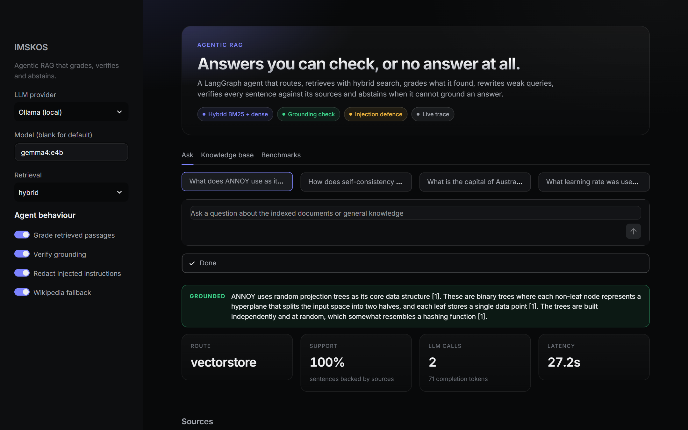
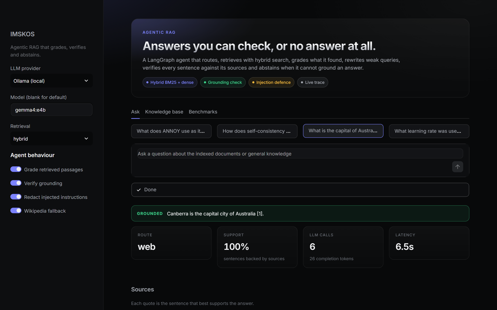
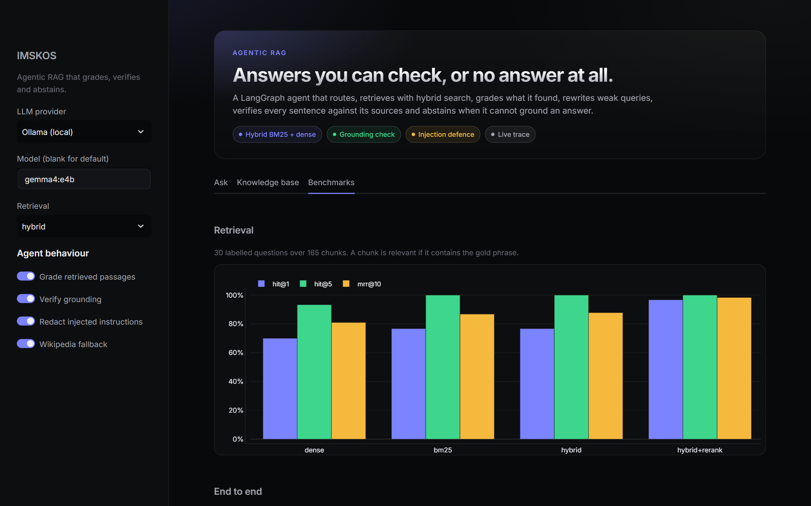

# IMSKOS

**Intelligent Multi-Source Knowledge Orchestration System**: an agentic RAG pipeline built on LangGraph that retrieves with hybrid search, grades what it found, verifies what it wrote, and says "I don't know" when it cannot ground an answer.

<p align="center"></p>

```
question -> (route) -> retrieve -> grade --relevant--> generate -> verify --grounded--> answer + citations
                          ^           |                   ^            |
                          |           +--none relevant--> rewrite      +--not grounded--> regenerate once -> abstain
                          +-------------------------------+
                                       after 2 rewrites: Wikipedia fallback
```

## What is measured

Everything below comes from `benchmarks/results/*.json`, produced by `python -m imskos eval all` with a local `gemma4:e4b` model on CPU and three Lilian Weng posts as the corpus (165 chunks). Full tables, caveats and the failures are in [docs/BENCHMARKS.md](docs/BENCHMARKS.md).

**Retrieval** (30 labelled questions, a chunk is relevant if it contains the gold phrase):

| Mode | hit@1 | hit@5 | MRR@10 | nDCG@10 |
|---|---|---|---|---|
| Dense (MiniLM) | 0.70 | 0.93 | 0.81 | 0.84 |
| BM25 | 0.77 | 1.00 | 0.87 | 0.90 |
| Hybrid (RRF) | 0.77 | 1.00 | 0.88 | 0.89 |
| Hybrid + cross-encoder rerank | **0.97** | 1.00 | **0.98** | 0.98 |

**End to end** (30 answerable, 10 unanswerable, 10 general-knowledge questions):

| Configuration | Answered correctly | Abstained when unanswerable | Notes |
|---|---|---|---|
| Plain RAG (retrieve, generate) | **100%** | **100%** | no web fallback, cannot answer the general questions |
| Agent, LLM router | 77% | 100% | 90% of general questions correct via Wikipedia |
| Agent, retrieval first (default) | 80% | 90% | 80% of general questions correct via Wikipedia |

**Read this before quoting the numbers.** On this model and corpus the plain pipeline is the most accurate one. The agent's value here is the Wikipedia fallback, which the baseline lacks, and its cost is a more conservative answerer: it abstains on 13 to 20% of questions the baseline answers correctly, because grading and grounding checks are strict. Differences of a few points are noise at this sample size (one question is 3.3 points), the default routing was chosen after seeing the first run, and the injection benchmark did not discriminate (see below). I would rather show that than a flattering chart.

## Features

- **Real LangGraph `StateGraph`** ([imskos/graph.py](imskos/graph.py)): route, retrieve, grade, rewrite, web, generate, verify, regenerate, abstain, with bounded loops and a per-node trace (name, milliseconds, details).
- **Hybrid retrieval**: BM25 and dense search fused by reciprocal rank fusion, optional cross-encoder rerank (hit@1 rises from 0.77 to 0.97 on the benchmark, at about 2 s per query on CPU).
- **Corrective RAG**: the LLM grades retrieved passages, weak queries are rewritten and retried, and Wikipedia is the last resort.
- **Grounding check** ([imskos/support.py](imskos/support.py)): a deterministic, model-free test of every answer sentence against the passages. Numbers must match, invented citation markers are stripped, and the best-supporting sentence becomes the quote shown to the user.
- **Abstention**: an ungrounded answer is regenerated once with feedback and then replaced by an explicit "I don't know based on the available sources."
- **Indirect prompt-injection defence** ([imskos/sanitize.py](imskos/sanitize.py)): instruction-like sentences in retrieved text are removed before they reach any prompt. It redacted the attack sentence in 32 of 32 instruction-style runs and removed nothing from the benign corpus.
- **Idempotent ingestion**: content-hash per source, so re-ingesting an unchanged page does nothing and a changed page replaces its old chunks. URL, PDF, HTML and text loaders.
- **Pluggable stores**: local numpy + BM25 store, and DataStax Astra DB through its Data API (dense only; contract-tested against a mock, not run against a live database).
- **Interfaces**: CLI, REST API with Server-Sent Events (`/ask/stream` emits one event per graph node), and a Streamlit app with a live agent trace.
- **Evaluation harness** in the package: labelled questions with gold phrases that are checked against the live corpus, bootstrap confidence intervals, an injection suite, and a chunk-size sweep.

## Quick start

```bash
pip install -r requirements.txt && pip install -e .
export GROQ_API_KEY=...                 # or: --provider ollama --model gemma4:e4b
                                        # or hosted Ollama models: --provider ollama_cloud --model gpt-oss:120b (needs OLLAMA_API_KEY)
python -m imskos ingest https://lilianweng.github.io/posts/2023-06-23-agent/
python -m imskos ask "What does ANNOY use as its core data structure?" --trace
streamlit run app.py
```

Reproduce the benchmarks:

```bash
make eval-retrieval                                  # no LLM needed
make eval PROVIDER=ollama MODEL=gemma4:e4b           # retrieval + end to end + injection (takes hours on CPU)
```

## Deploying on a Hugging Face Space

The workflow in [.github/workflows/sync_to_hub.yml](.github/workflows/sync_to_hub.yml) pushes `main` to the Space on every merge (it needs a write-access `HF_TOKEN` repository secret). In the Space, open **Settings, Variables and secrets** and add:

| Kind | Name | Value |
|---|---|---|
| Secret | `OLLAMA_API_KEY` (or `GROQ_API_KEY`) | your key |
| Variable | `IMSKOS_PROVIDER` | `ollama_cloud` (or `groq`) |
| Variable | `IMSKOS_MODEL` | for example `gpt-oss:120b` |
| Variable | `IMSKOS_EMBEDDING_MODEL` | optional; `hash` skips the model download and gives weaker retrieval |
| Variable | `IMSKOS_SEED_URLS` | space-separated URLs to index on first start |

The sidebar defaults come from these variables. The Space filesystem is ephemeral, so the seed URLs are re-indexed after each restart.

## Screenshots

<table>
<tr>
<td width="50%"><br><sub>A general question falls through to Wikipedia after the knowledge base has nothing relevant</sub></td>
<td width="50%"><br><sub>Benchmarks tab, rendered from the committed JSON</sub></td>
</tr>
</table>

The interface is dark-first (near-black canvas, graphite surfaces, one indigo accent) in the style of modern developer tools. Screenshots are real runs against a local `gemma4:e4b` model.

## Honest limitations

- On the benchmark, plain RAG beat both agent configurations for in-corpus questions. The grading and verification layers are conservative with a small local model; a stronger model or a weaker retriever may change that, and I have not measured it.
- The grounding check is lexical. It catches invented numbers and names, and it can pass a fluent sentence that reuses passage words with a different meaning (one unanswerable question was answered with an off-topic but passage-supported sentence).
- The injection benchmark showed 0 successful attacks with the defence on **and off**, including content-poisoning variants, so it cannot show that the defence helps. The model resisted. The sanitiser is a heuristic filter, unit-tested, and its patterns were written with the attack phrasings in mind.
- 30 answerable questions over three blog posts is a small corpus. Gold phrases were chosen by the author.
- Latency was measured while other jobs shared the CPU and is not comparable across configurations.
- Wikipedia fallback uses the search API and intro paragraphs only.

## Layout

```
imskos/       graph, retrieval, store, embeddings, loaders, grounding check, sanitiser, API, CLI
  eval/       corpus loader, labelled questions, retrieval / end-to-end / injection runners
app.py        Streamlit app
tests/        68 tests (fake LLM and hash embedder, no network)
docs/         ARCHITECTURE.md, BENCHMARKS.md
```

## License

MIT, see [LICENSE](LICENSE).
